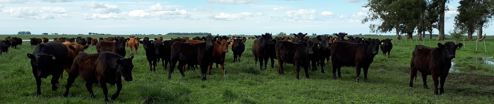
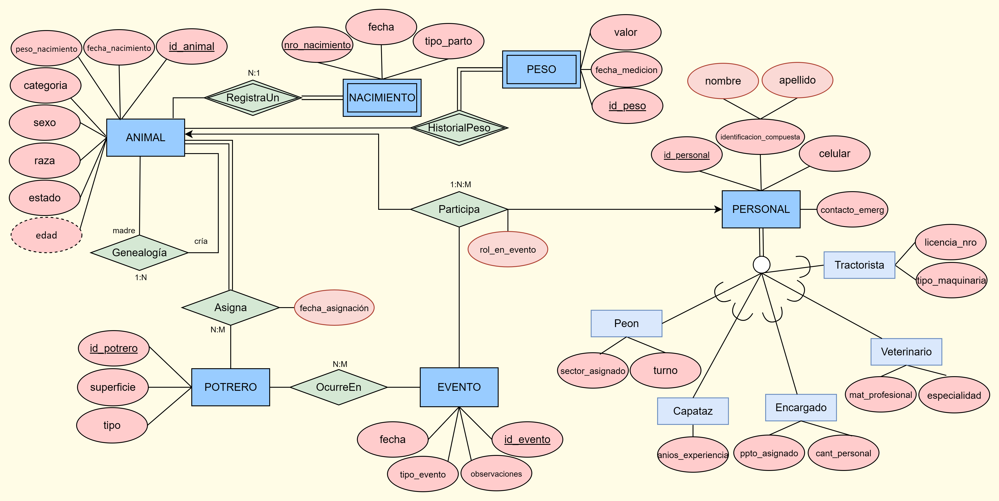
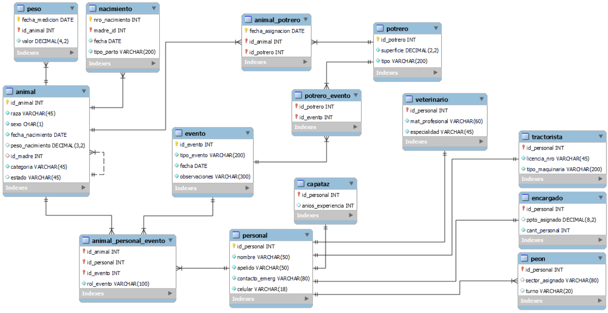

<p align="center">
  
</p>


# Proyecto de Base de Datos - **Gestión Rural**
**Materia:** Tópicos de Bases de Datos  
**Carrera:** Especialización en Ciencia de Datos – UNLaM  
**Profesor:** Julio Bossero  
**Año:** 2025  

---

## 📚 Índice
- [Proyecto de Base de Datos - **Gestión Rural**](#proyecto-de-base-de-datos---gestión-rural)
  - [📚 Índice](#-índice)
  - [Descripción General](#descripción-general)
  - [Estructura del Proyecto](#estructura-del-proyecto)
  - [TP1: Modelado Conceptual y Relacional](#tp1-modelado-conceptual-y-relacional)
  - [TP2: Implementación en SQL Server (DDL)](#tp2-implementación-en-sql-server-ddl)
  - [TP3: Operaciones DML y Consultas Avanzadas](#tp3-operaciones-dml-y-consultas-avanzadas)
  - [TP4: Stored Procedures, Triggers, Cursores y Carga de Datos Externa](#tp4-stored-procedures-triggers-cursores-y-carga-de-datos-externa)
    - [Procedimientos Almacenados (Stored Procedures)](#procedimientos-almacenados-stored-procedures)
    - [Triggers](#triggers)
    - [Importación y Actualización de Datos](#importación-y-actualización-de-datos)
  - [Conclusiones Generales](#conclusiones-generales)
  - [Autores](#autores)
  - [Licencia](#licencia)

---

## Descripción General

El proyecto **Gestión Rural** simula la administración integral de un establecimiento ganadero, denominado **“La Josefina”**, orientado a la cría de bovinos.  
A lo largo de cuatro trabajos prácticos se desarrolló el ciclo completo de vida de una base de datos:

1. **Modelado conceptual y lógico.**  
2. **Implementación física en SQL Server.**  
3. **Consultas DML y funciones avanzadas.**  
4. **Automatización mediante procedimientos, triggers y carga de datos desde archivos externos.**

---

## Estructura del Proyecto

```bash
📦 BD_La_Josefina
│
├── 📂 pdf/                       # Documentación teórica de cada TP
│   ├── TP1_GrupoVI.pdf
│   ├── TP2_GrupoVI.pdf
│   └── TP3_GrupoVI.pdf
│
├── 📂 sql/                       # Código SQL utilizado en cada trabajo
│   ├── TP2_DDL.sql
│   ├── TP3_DML_Consultas.sql
│   └── TP4_Procedimientos_Triggers.sql
│
├── 📂 data/                      # Archivos utilizados para carga externa
│   ├── personal.json
│   ├── pesos1.csv
│   └── pesos2.csv
│
├── 📂 assets/                    # Imágenes y recursos visuales
│   ├── DER.png
│   ├── grupo_de_vacas.jpg
│   └── MER.png
│
└── 📜 README.md
```

## TP1: Modelado Conceptual y Relacional

> - 📄 **Documento:** [TP1_GrupoVI.pdf](pdf/TP1_GrupoVI.pdf)


📷 Imágenes:



**Objetivo:**
Diseñar el modelo conceptual y lógico del sistema ganadero, aplicando reglas de negocio e identificando entidades, relaciones y atributos.

**Aspectos principales:**
- **Entidades:** Animal, Potrero, Evento, Personal, Peso, Nacimiento.  
- **Relaciones:**  
  - Binarias: Animal–Potrero, Potrero–Evento.  
  - Ternaria: Animal–Personal–Evento.  
  - Reflexiva: Genealogía (madre–cría).  
- **Jerarquía de Personal:** Peón, Capataz, Tractorista, Veterinario, Encargado.  
- **Atributos especiales:**  
  - Compuesto: nombre y apellido.  
  - Multivaluado: historial de pesos.  
  - Derivado: edad del animal.  
  - Normalización: hasta la Tercera Forma Normal (3FN).

El modelo se representó en notación **Chen y Crow’s Foot** y se normalizó hasta la **Tercera Forma Normal (3FN)**.

---


## TP2: Implementación en SQL Server (DDL)

> * 📄 **Documento:** [TP2_GrupoVI.pdf](pdf/TP2_GrupoVI.pdf)
> * 💾 **Código:** [TP2_DDL.sql](sql/TP2_DDL.sql)

**Objetivo:**
Implementar el modelo relacional en SQL Server mediante lenguaje DDL.

**Estructura del proyecto:**
- **Base:** `GRUPOVI`
- **Esquemas:**  
  - `produccion`: entidades principales (Animal, Peso, Nacimiento, Potrero).  
  - `rrhh`: gestión del personal y sus roles.  
  - `gestion`: relaciones entre recursos productivos y humanos.  

**Componentes implementados:**
- Tablas, claves primarias y foráneas.  
- Restricciones `NOT NULL`, `CHECK`, `DEFAULT`, `UNIQUE`.  
- Índices clustered y nonclustered.  
- Tablas temporales (locales, globales y variables).  
- Comandos `ALTER`, `DROP` y `TRUNCATE`.  

Se aplicaron principios de **integridad referencial, modularidad y documentación estructurada**.

---

## TP3: Operaciones DML y Consultas Avanzadas

> * 📄 **Documento:** [TP3_GrupoVI.pdf](pdf/TP3_GrupoVI.pdf)
> * 💾 **Código:** [TP3_DML_Consultas.sql](sql/TP3_DML_Consultas.sql)

**Objetivo:**  
Aplicar operaciones de manipulación de datos (**INSERT, UPDATE, DELETE, SELECT**) y desarrollar consultas complejas.

**Tareas realizadas:**
- Inserciones automáticas y manuales en todas las tablas.  
- Consultas con:
  - `JOIN`, subconsultas, `EXISTS`, `ANY`, `ALL`.  
  - Funciones matemáticas, de texto y de fecha.  
  - Funciones definidas por el usuario (UDFs).  
  - Funciones de ventana (`ROW_NUMBER()`, `RANK()`, `DENSE_RANK()`).  
  - **CTE recursivas** (para genealogía madre–cría).  
  - Transformaciones con `PIVOT` y `UNPIVOT`.  
- Creación de **vistas**:
  - Animales activos con su último peso.  
  - Eventos con personal asignado.  
  - Superficie disponible en potreros.

El resultado fue un conjunto de consultas que permiten **analizar la productividad y trazabilidad** del sistema rural.

---

## TP4: Stored Procedures, Triggers, Cursores y Carga de Datos Externa

> * 💾 **Código:** [TP4_Procedimientos_Triggers.sql](sql/TP4_Procedimientos_Triggers.sql)


📂 Archivos externos:

> * [personal.json](data/personal.json)
> * [pesos1.csv](data/pesos1.csv) 
> * [pesos2.csv](data/pesos2.csv)

> Nota: los ejemplos de importación en `sql/TP4_Procedimientos_Triggers.sql` usan rutas relativas a la raíz del repositorio (p. ej. `data\personal.json`, `data\pesos1.csv`). Dependiendo de cómo esté configurado tu servidor SQL, puede ser necesario adaptar estas rutas a una ubicación accesible por el servicio (ruta absoluta) y habilitar permisos para lecturas con `OPENROWSET`/`BULK INSERT`.

**Objetivo:**  
Incorporar automatización, auditoría y manejo de datos externos a la base implementada.

### Procedimientos Almacenados (Stored Procedures)
1. **`sp_AnalisisPesoAnimal`**  
   - Consulta parametrizada por edad y categoría.  
   - Calcula la variación porcentual entre el primer y último peso de cada animal activo.  
   - Devuelve un mensaje con la menor variación registrada.

2. **`InsertarAnimal`**  
   - Inserta un nuevo animal en la tabla `produccion.Animal`.  
   - Incluye validaciones sobre raza, sexo, fecha de nacimiento, peso y categoría.  
   - Utiliza manejo de errores (`TRY...CATCH`) y parámetro de salida con el ID insertado.

3. **`EliminarAnimal`**  
   - Elimina un animal solo si existe y **no tiene crías asociadas**.  
   - Aplica control de integridad lógica antes de la eliminación.

4. **`sp_Var_PesoAnimal` (con Cursor)**  
   - Recorre los registros de peso de un animal específico.  
   - Muestra en consola la variación porcentual entre cada medición sucesiva.

---

### Triggers
1. **`trg_AfterInsert_Animal` (AFTER INSERT)**  
   - Crea una tabla de auditoría `Animal_Auditoria`.  
   - Registra automáticamente cada inserción en la tabla `Animal` con fecha y hora.

2. **`trg_InsteadOfUpdate_Categoria` (INSTEAD OF UPDATE)**  
   - Valida que solo los animales **hembras con 3 o más años** puedan cambiar su categoría a “Vaca”.  
   - Impide actualizaciones que violen esta regla e informa el motivo en consola.

---

### Importación y Actualización de Datos

1. **Importación desde JSON**
   - Se cargaron registros en `rrhh.Personal` desde un archivo `personal.json` mediante `OPENROWSET` y `OPENJSON`.
   - Incluye habilitación de `Ad Hoc Distributed Queries`.

2. **Actualización desde CSV**
   - Se crearon tablas temporales (`#Peso_Temp`) y se cargaron archivos CSV con datos de peso (`pesos1.csv`, `pesos2.csv`).
   - Se utilizó la sentencia `MERGE` para insertar o actualizar registros según coincidencia.
   - Demostración de detección de duplicados y actualizaciones condicionales.

---

## Conclusiones Generales

El proyecto permitió:
- Aplicar de forma práctica los **conceptos de diseño, normalización y administración de bases de datos**.  
- Integrar **estructuras de control y automatización** en SQL Server.  
- Simular un entorno productivo completo con manejo de datos reales y auditoría.  
- Consolidar el conocimiento del lenguaje SQL y las buenas prácticas de modelado y mantenimiento de datos.


## Autores

| Yesica Fica Millán        | Florencia Miranda Charca  | Franco Petraroia           |
|---------------------------|---------------------------|----------------------------|
| [LinkedIn](https://www.linkedin.com/in/yesica-fica-millan/) | [LinkedIn](https://www.linkedin.com/in/florencia-m-32908b17b/) | [LinkedIn](https://www.linkedin.com/in/franco-petraroia/) |


---

## Licencia

Proyecto académico desarrollado en el marco de la **Especialización en Ciencia de Datos (UNLaM)**.  
Uso libre con fines educativos.
